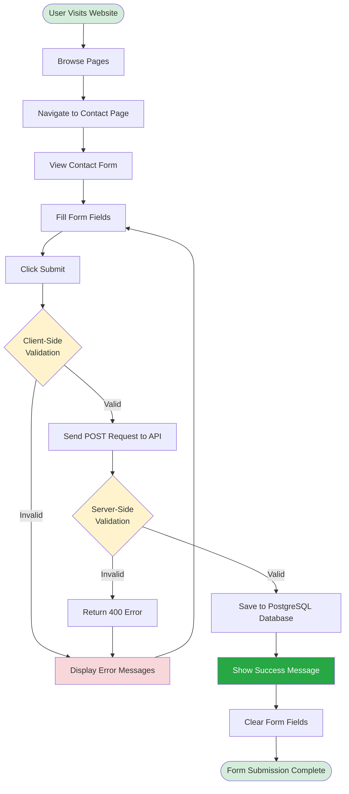
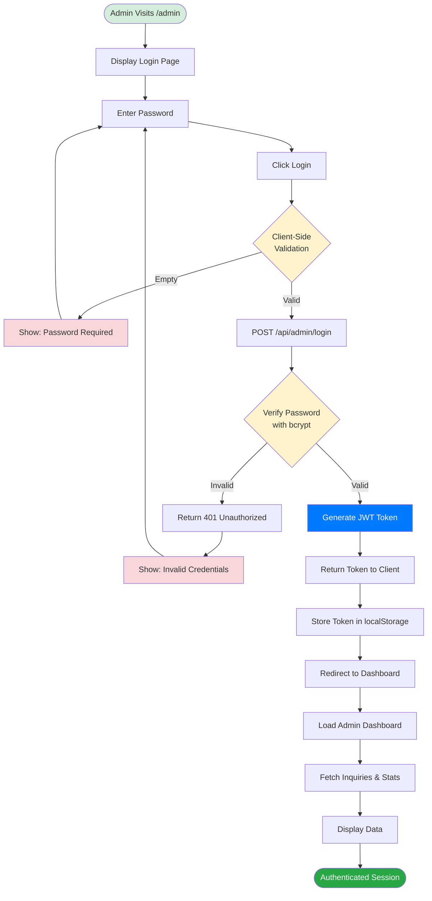
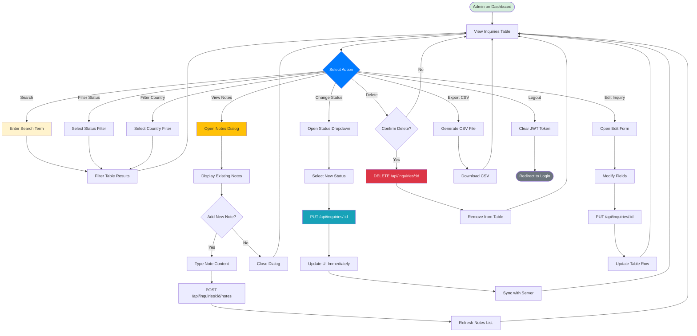
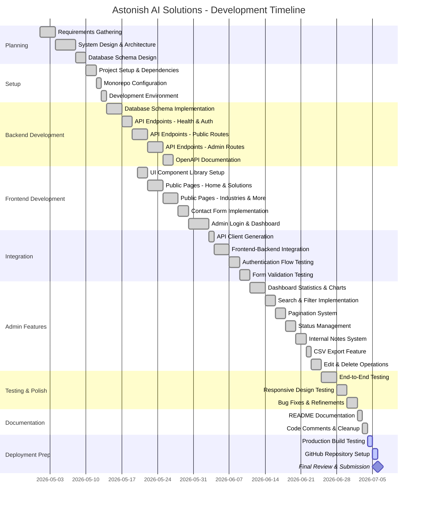
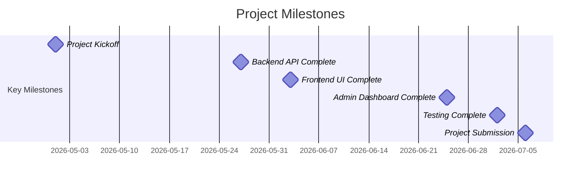
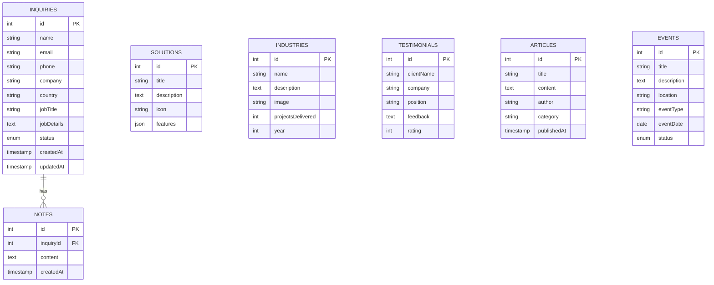
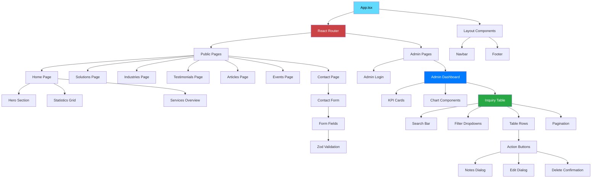
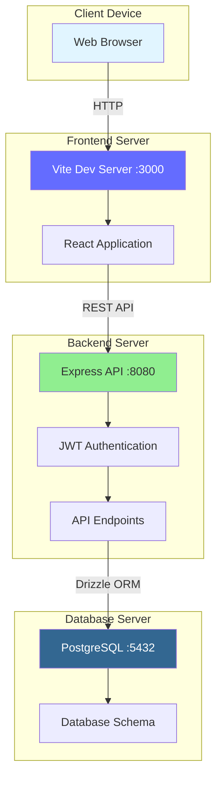

# Design Documentation - Astonish AI Solutions

## Table of Contents
1. [Wireframes](#wireframes)
2. [Flowcharts](#flowcharts)
3. [Gantt Chart](#gantt-chart)

---

## Wireframes

### 1. Homepage Wireframe

```mermaid
graph TD
    subgraph "Homepage Layout"
        A[Navigation Bar<br/>Logo | Solutions | Industries | Testimonials | Articles | Events | Contact]
        B[Hero Section<br/>Main Heading<br/>Subheading<br/>CTA Buttons]
        C[Statistics Grid<br/>500+ Projects | 98% Success | 50+ Industries]
        D[Services Overview<br/>6 AI Solutions Cards]
        E[Client Logos Section<br/>Trusted Partners]
        F[Call to Action<br/>Get Started Button]
        G[Footer<br/>Links | Social Media | Copyright]
    end
    
    A --> B
    B --> C
    C --> D
    D --> E
    E --> F
    F --> G
    
    style A fill:#f5f5f5,stroke:#333,stroke-width:1px
    style B fill:#ffffff,stroke:#333,stroke-width:1px
    style C fill:#ffffff,stroke:#333,stroke-width:1px
    style D fill:#ffffff,stroke:#333,stroke-width:1px
    style E fill:#ffffff,stroke:#333,stroke-width:1px
    style F fill:#e0e0e0,stroke:#333,stroke-width:1px
    style G fill:#f5f5f5,stroke:#333,stroke-width:1px
```

### 2. Contact Page Wireframe

```mermaid
graph TD
    subgraph "Contact Page Layout"
        A[Navigation Bar]
        B[Page Header<br/>Contact Us Title]
        C[Contact Form Container]
        D[Name Field - Required]
        E[Email Field - Required]
        F[Phone Field - Required]
        G[Company Field - Required]
        H[Country Dropdown - Required]
        I[Job Title Field - Required]
        J[Job Details Textarea - Required]
        K[Submit Button]
        L[Validation Messages Area]
        M[Footer]
    end
    
    A --> B
    B --> C
    C --> D
    D --> E
    E --> F
    F --> G
    G --> H
    H --> I
    I --> J
    J --> K
    K --> L
    L --> M
    
    style A fill:#f5f5f5,stroke:#333,stroke-width:1px
    style C fill:#ffffff,stroke:#333,stroke-width:1px
    style K fill:#e0e0e0,stroke:#333,stroke-width:1px
    style L fill:#ffffff,stroke:#333,stroke-width:1px
    style M fill:#f5f5f5,stroke:#333,stroke-width:1px
```



### 3. Admin Dashboard Wireframe

```mermaid
graph TD
    subgraph "Admin Dashboard Layout"
        A[Header Bar<br/>Logo | Admin Dashboard | Logout]
        B[KPI Cards Row<br/>Total Inquiries | Unique Countries | Unique Job Titles]
        C[Charts Section]
        D[Bar Chart - Inquiries by Country]
        E[Pie Chart - Job Titles Distribution]
        F[Recent Inquiries Table]
        G[Table Headers<br/>Name | Email | Company | Country | Status | Actions]
        H[Search & Filter Bar<br/>Search | Status Filter | Country Filter]
        I[Action Buttons<br/>View | Edit | Delete | Notes]
        J[Pagination Controls]
    end
    
    A --> B
    B --> C
    C --> D
    C --> E
    E --> H
    H --> F
    F --> G
    G --> I
    I --> J
    
    style A fill:#e0e0e0,stroke:#333,stroke-width:1px
    style B fill:#ffffff,stroke:#333,stroke-width:1px
    style C fill:#ffffff,stroke:#333,stroke-width:1px
    style F fill:#ffffff,stroke:#333,stroke-width:1px
    style H fill:#f5f5f5,stroke:#333,stroke-width:1px
    style I fill:#e0e0e0,stroke:#333,stroke-width:1px
```

---

## Flowcharts

### 1. User Journey - Contact Form Submission



### 2. Admin Authentication Flow



### 3. Inquiry Management Flow



### 4. System Architecture Flow

```mermaid
flowchart LR
    subgraph Client ["Client Layer"]
        Browser[Web Browser]
        React[React 19 SPA]
        ReactQuery[React Query Cache]
    end
    
    subgraph API ["API Layer"]
        Express[Express 5 Server]
        Auth[JWT Auth Middleware]
        Routes[API Routes]
        Validation[Zod Validation]
    end
    
    subgraph Database ["Database Layer"]
        Drizzle[Drizzle ORM]
        PostgreSQL[(PostgreSQL 18)]
    end
    
    Browser --> React
    React --> ReactQuery
    ReactQuery -->|HTTP/REST| Express
    Express --> Auth
    Auth --> Routes
    Routes --> Validation
    Validation --> Drizzle
    Drizzle --> PostgreSQL
    PostgreSQL -->|Query Results| Drizzle
    Drizzle -->|JSON Response| Routes
    Routes -->|API Response| ReactQuery
    ReactQuery --> React
    React --> Browser
    
    style Browser fill:#e1f5ff
    style React fill:#61dafb,color:#000
    style Express fill:#90ee90
    style PostgreSQL fill:#336791,color:#fff
    style Auth fill:#ffc107
    style Validation fill:#ff6b6b,color:#fff
```



---

## Gantt Chart

### Project Development Timeline (8 Weeks)



### Milestone Timeline



---

## Additional Diagrams

### Entity Relationship Diagram



### Component Hierarchy



---

## Deployment Architecture



---

## How to View These Diagrams

### Option 1: GitHub (Automatic Rendering)
When pushed to GitHub, all Mermaid diagrams render automatically in the markdown file.

### Option 2: VS Code Extension
Install "Markdown Preview Mermaid Support" extension to view in VS Code.

### Option 3: Online Viewer
Copy diagram code to https://mermaid.live for interactive viewing.

### Option 4: Export as Images
Use Mermaid CLI or online tools to export as PNG/SVG.

---

**Documentation Created:** July 2026  
**Project:** Astonish AI Solutions  
**Author:** Subekshya Regmi  
**Module:** CET333 Product Development
