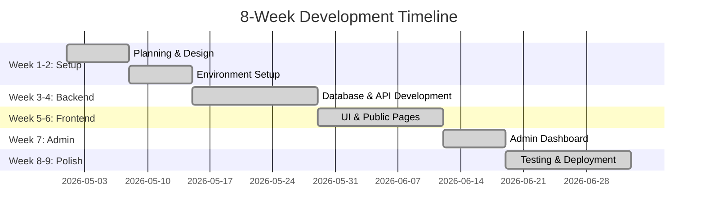
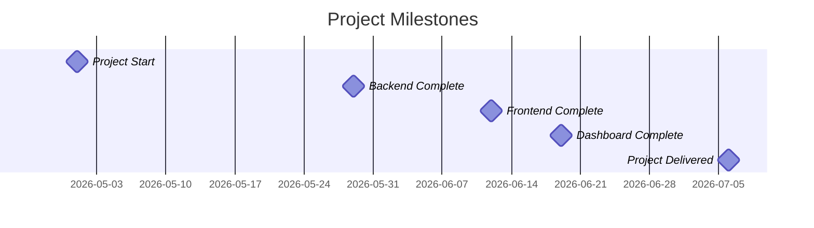
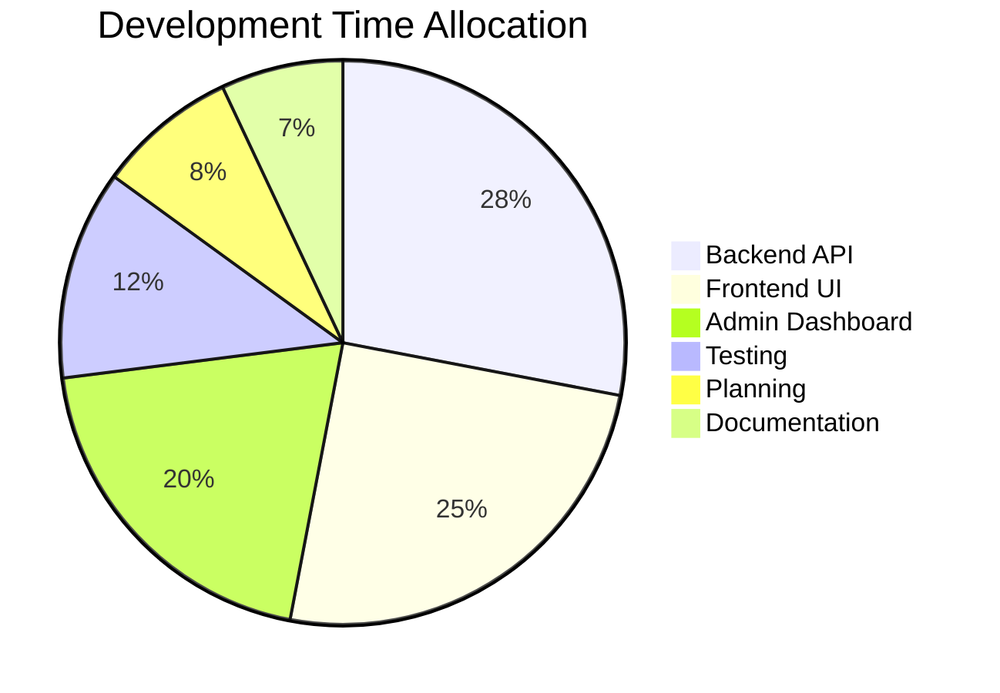

# 📅 Project Schedule & Gantt Chart
## Astonish AI Solutions

> **Duration:** 8 Weeks | **Status:** ✅ Completed | **Delivery:** July 6, 2026

---

---

## 📊 Main Project Timeline

---

## 🎯 Key Milestones

---

## 📋 Weekly Schedule

| Week | Phase | Focus Area | Key Deliverables |
|------|-------|------------|------------------|
| **1** | 🎯 Planning | Requirements & Design | • Requirements Doc • System Architecture • Database Schema • Wireframes |
| **2** | ⚙️ Setup | Environment | • Dev Environment • Monorepo Config • Database Setup |
| **3-4** | 🔧 Backend | API Development | • Database Schema • Express Server • 7 API Endpoints • Authentication |
| **5-6** | 🎨 Frontend | UI & Pages | • React App • 6 Public Pages • Contact Form • Components |
| **7** | 👨‍💼 Admin | Dashboard | • Admin Login • Statistics • Charts • Data Table |
| **8** | ✨ Features | Quick Wins | • Search & Filter • Pagination • Notes System • CSV Export |
| **9** | ✅ Deploy | Testing & Launch | • Testing • Bug Fixes • Documentation • GitHub Push |

---

## 📊 Time Distribution

---

## 🎯 Deliverables Summary

### ✅ Phase 1-2: Foundation (Week 1-2)
- Requirements Document
- System Architecture
- Database Schema Design
- Development Environment
- Monorepo Structure

### ✅ Phase 3-4: Backend (Week 3-4)
- PostgreSQL Database
- Express API Server
- JWT Authentication
- 7 API Endpoint Groups
- OpenAPI Documentation

### ✅ Phase 5-6: Frontend (Week 5-6)
- React 19 Application
- UI Component Library
- 6 Public Pages
- Contact Form with Validation
- Responsive Design

### ✅ Phase 7: Admin (Week 7)
- Admin Authentication
- Dashboard with KPIs
- Charts & Visualizations
- Inquiries Management Table
- Search & Filter System

### ✅ Phase 8-9: Polish (Week 8-9)
- Pagination System
- Status Management
- Internal Notes CRUD
- CSV Export Feature
- Complete Testing
- GitHub Repository

---

## 🛠️ Technology Timeline

| Technology | Week | Purpose |
|-----------|------|---------|
| PostgreSQL 18 | 2 | Database |
| Drizzle ORM | 3 | Type-safe queries |
| Express 5 | 3 | API server |
| TypeScript | 2 | Type safety |
| React 19 | 5 | Frontend framework |
| React Query | 5 | Data fetching |
| Zod | 4 | Validation |
| TanStack Table | 7 | Data tables |
| Tailwind CSS | 5 | Styling |

---

## 📈 Project Status

**Status:** ✅ **COMPLETED**  
**Submission:** July 6, 2026  
**Duration:** 63 days (9 weeks)  
**Features:** 25+ implemented  
**Pages:** 8 total (7 public + 1 admin)

---

**Author:** Subekshya Regmi  
**Module:** CET333 Product Development  
**GitHub:** [View Repository](https://github.com/subekshyaregmi2007-source/astonish-ai-solutions)
