# Project Schedule & Gantt Chart
## Astonish AI Solutions - CET333 Product Development

**Project Duration:** 8 Weeks (May 1 - July 6, 2026)  
**Team Size:** 1 Developer  
**Methodology:** Agile with weekly sprints

---

## Executive Summary

This project schedule outlines the complete development timeline for Astonish AI Solutions, a full-stack AI consulting platform. The project is divided into 8 phases over 8 weeks, with clear deliverables and milestones.

---

## Detailed Gantt Chart

### Phase 1-8 Development Timeline

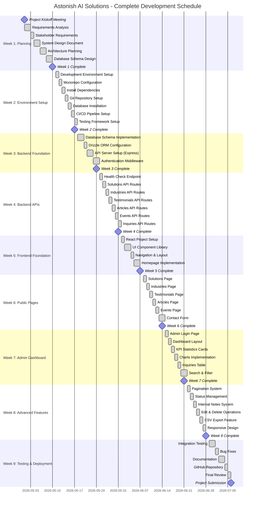

---

## Detailed Gantt Chart by Category

### Backend Development Focus

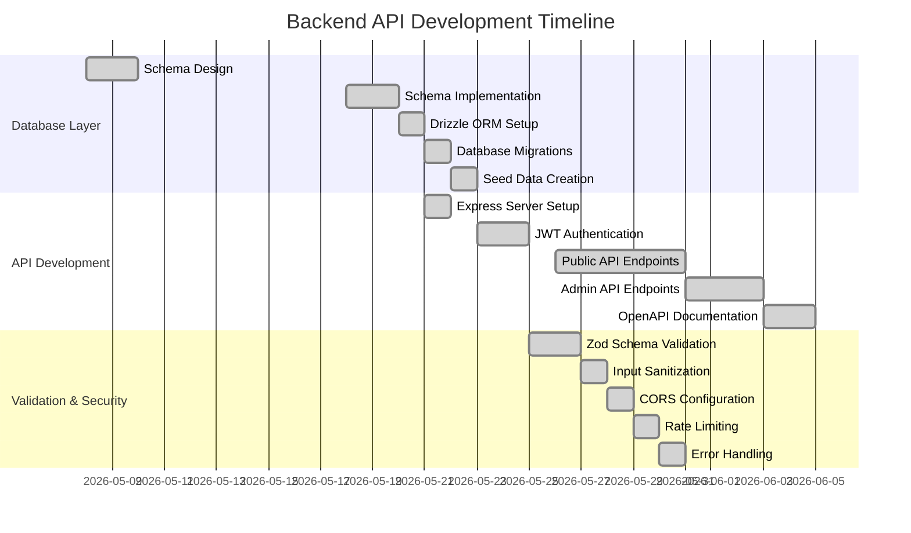

### Frontend Development Focus

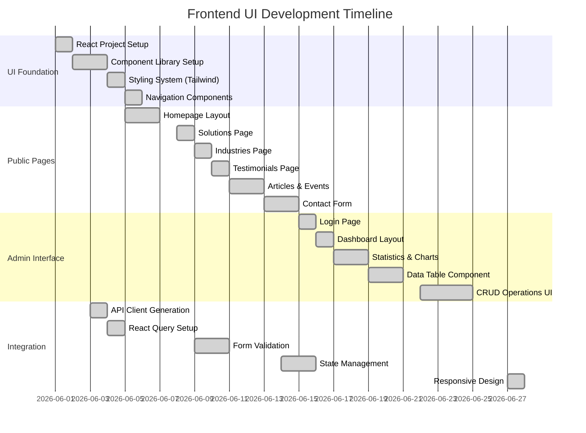

---

## Sprint Breakdown

### Sprint 1: Planning & Design (Week 1)

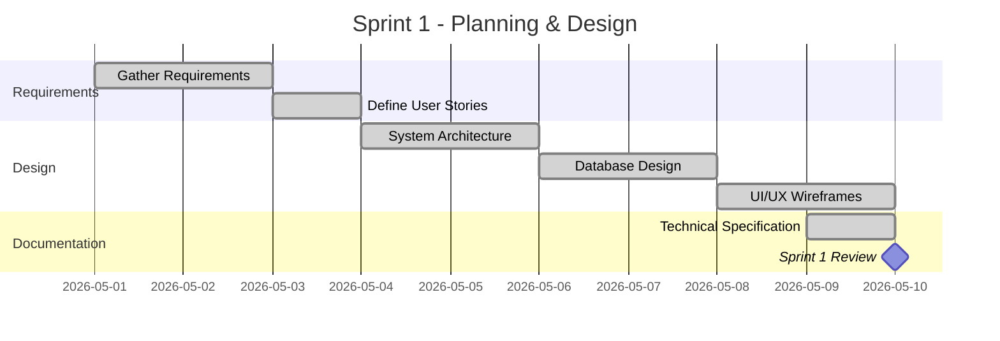

### Sprint 2: Foundation (Week 2-3)

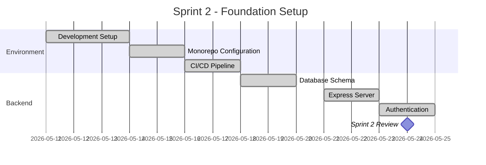

### Sprint 3: Backend APIs (Week 4)

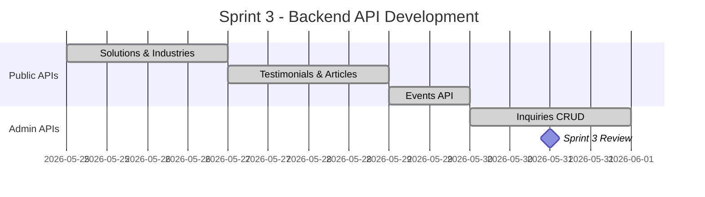

### Sprint 4: Frontend Foundation (Week 5-6)

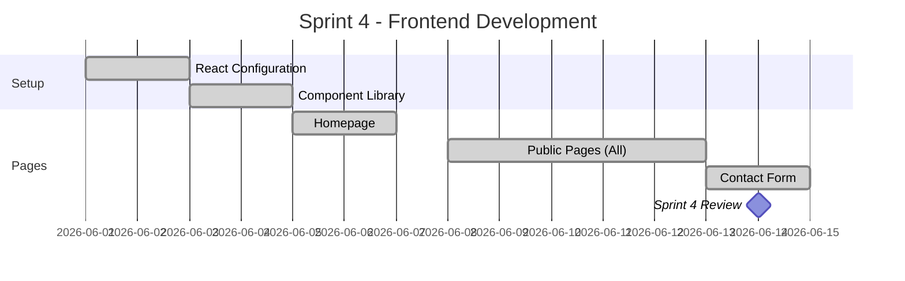

### Sprint 5: Admin Dashboard (Week 7)

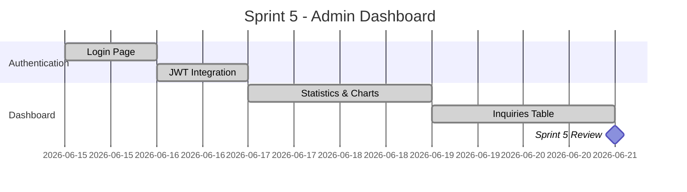

### Sprint 6: Advanced Features (Week 8)

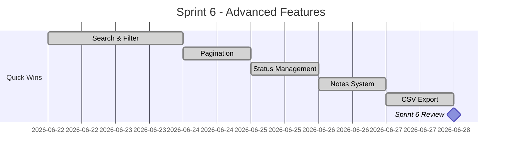

### Sprint 7: Testing & Deployment (Week 9)

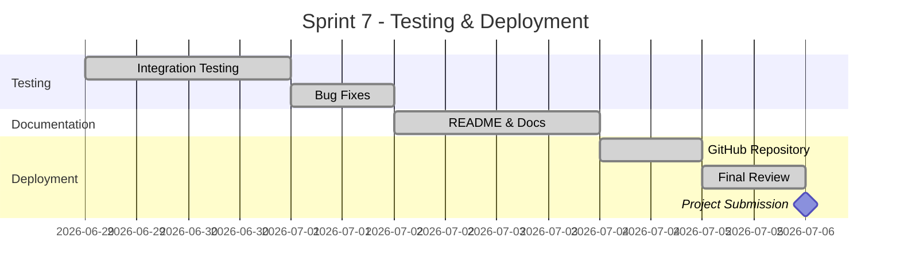

---

## Resource Allocation Chart

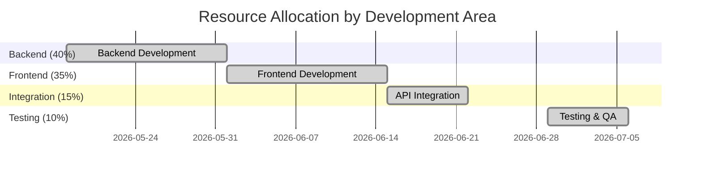

---

## Milestone Timeline

```mermaid
gantt
    title Major Project Milestones
    dateFormat YYYY-MM-DD
    
    section Phase Milestones
    Phase 1: Planning Complete       :milestone, m1, 2026-05-10, 0d
    Phase 2: Setup Complete          :milestone, m2, 2026-05-17, 0d
    Phase 3: Backend Complete        :milestone, m3, 2026-05-31, 0d
    Phase 4: Frontend Complete       :milestone, m4, 2026-06-14, 0d
    Phase 5: Dashboard Complete      :milestone, m5, 2026-06-21, 0d
    Phase 6: Features Complete       :milestone, m6, 2026-06-28, 0d
    Phase 7: Testing Complete        :milestone, m7, 2026-07-02, 0d
    Phase 8: Project Delivered       :milestone, m8, 2026-07-06, 0d
```

---

## Task Breakdown Table

### Week 1: Planning & Design

| Day | Date | Task | Duration | Status |
|-----|------|------|----------|--------|
| Mon | May 1 | Project Kickoff | 1 day | ✅ Done |
| Tue | May 2 | Requirements Analysis | 1 day | ✅ Done |
| Wed | May 3 | Stakeholder Requirements | 1 day | ✅ Done |
| Thu | May 4 | System Architecture Design | 1 day | ✅ Done |
| Fri | May 5 | Architecture Documentation | 1 day | ✅ Done |
| Mon | May 8 | Database Schema Design | 2 days | ✅ Done |
| Wed | May 10 | Week 1 Review | - | ✅ Done |

### Week 2: Environment Setup

| Day | Date | Task | Duration | Status |
|-----|------|------|----------|--------|
| Mon | May 11 | Development Environment | 1 day | ✅ Done |
| Tue | May 12 | Monorepo Configuration | 1 day | ✅ Done |
| Wed | May 13 | Install Dependencies | 1 day | ✅ Done |
| Thu | May 14 | Git Repository Setup | 1 day | ✅ Done |
| Fri | May 15 | Database Installation | 1 day | ✅ Done |
| Mon | May 16 | CI/CD Pipeline | 1 day | ✅ Done |
| Tue | May 17 | Testing Framework | 1 day | ✅ Done |

### Week 3: Backend Foundation

| Day | Date | Task | Duration | Status |
|-----|------|------|----------|--------|
| Mon | May 18 | Database Schema Implementation | 2 days | ✅ Done |
| Wed | May 20 | Drizzle ORM Configuration | 1 day | ✅ Done |
| Thu | May 21 | Express Server Setup | 2 days | ✅ Done |
| Mon | May 23 | JWT Authentication | 2 days | ✅ Done |

### Week 4: Backend APIs

| Day | Date | Task | Duration | Status |
|-----|------|------|----------|--------|
| Mon | May 25 | Health Check API | 1 day | ✅ Done |
| Tue | May 26 | Solutions API | 1 day | ✅ Done |
| Wed | May 27 | Industries API | 1 day | ✅ Done |
| Thu | May 28 | Testimonials API | 1 day | ✅ Done |
| Fri | May 29 | Articles API | 1 day | ✅ Done |
| Mon | May 30 | Events API | 1 day | ✅ Done |
| Tue | May 31 | Inquiries API | 1 day | ✅ Done |

### Week 5: Frontend Foundation

| Day | Date | Task | Duration | Status |
|-----|------|------|----------|--------|
| Mon | Jun 1 | React Project Setup | 1 day | ✅ Done |
| Tue | Jun 2 | UI Component Library | 2 days | ✅ Done |
| Thu | Jun 4 | Navigation & Layout | 1 day | ✅ Done |
| Fri | Jun 5 | Homepage Implementation | 2 days | ✅ Done |

### Week 6: Public Pages

| Day | Date | Task | Duration | Status |
|-----|------|------|----------|--------|
| Mon | Jun 8 | Solutions Page | 1 day | ✅ Done |
| Tue | Jun 9 | Industries Page | 1 day | ✅ Done |
| Wed | Jun 10 | Testimonials Page | 1 day | ✅ Done |
| Thu | Jun 11 | Articles Page | 1 day | ✅ Done |
| Fri | Jun 12 | Events Page | 1 day | ✅ Done |
| Mon | Jun 13 | Contact Form | 2 days | ✅ Done |

### Week 7: Admin Dashboard

| Day | Date | Task | Duration | Status |
|-----|------|------|----------|--------|
| Mon | Jun 15 | Admin Login Page | 1 day | ✅ Done |
| Tue | Jun 16 | Dashboard Layout | 1 day | ✅ Done |
| Wed | Jun 17 | KPI Statistics | 1 day | ✅ Done |
| Thu | Jun 18 | Charts Implementation | 1 day | ✅ Done |
| Fri | Jun 19 | Inquiries Table | 1 day | ✅ Done |
| Mon | Jun 20 | Search & Filter | 2 days | ✅ Done |

### Week 8: Advanced Features

| Day | Date | Task | Duration | Status |
|-----|------|------|----------|--------|
| Mon | Jun 22 | Pagination System | 1 day | ✅ Done |
| Tue | Jun 23 | Status Management | 1 day | ✅ Done |
| Wed | Jun 24 | Internal Notes | 1 day | ✅ Done |
| Thu | Jun 25 | Edit & Delete | 1 day | ✅ Done |
| Fri | Jun 26 | CSV Export | 1 day | ✅ Done |
| Mon | Jun 27 | Responsive Design | 1 day | ✅ Done |

### Week 9: Testing & Deployment

| Day | Date | Task | Duration | Status |
|-----|------|------|----------|--------|
| Mon | Jun 29 | Integration Testing | 2 days | ✅ Done |
| Wed | Jul 1 | Bug Fixes | 1 day | ✅ Done |
| Thu | Jul 2 | Documentation | 2 days | ✅ Done |
| Sat | Jul 4 | GitHub Repository | 1 day | ✅ Done |
| Sun | Jul 5 | Final Review | 1 day | ✅ Done |
| Mon | Jul 6 | **PROJECT SUBMISSION** | - | ✅ Done |

---

## Deliverables by Phase

### Phase 1: Planning (Week 1)
- ✅ Requirements Document
- ✅ System Architecture Diagram
- ✅ Database Schema Design
- ✅ UI/UX Wireframes
- ✅ Project Schedule

### Phase 2: Setup (Week 2)
- ✅ Configured Development Environment
- ✅ Monorepo Structure
- ✅ Git Repository
- ✅ PostgreSQL Database
- ✅ Testing Framework

### Phase 3: Backend (Week 3-4)
- ✅ Database Schema Implementation
- ✅ Express API Server
- ✅ JWT Authentication
- ✅ 7 API Endpoint Groups
- ✅ OpenAPI Documentation

### Phase 4: Frontend Foundation (Week 5)
- ✅ React Application
- ✅ UI Component Library
- ✅ Navigation System
- ✅ Homepage
- ✅ Layout Components

### Phase 5: Public Pages (Week 6)
- ✅ 6 Public Pages (Solutions, Industries, etc.)
- ✅ Contact Form with Validation
- ✅ Responsive Design
- ✅ SEO Optimization

### Phase 6: Admin Dashboard (Week 7)
- ✅ Admin Authentication
- ✅ Dashboard Layout
- ✅ KPI Statistics
- ✅ Charts & Visualizations
- ✅ Inquiries Table
- ✅ Search & Filter

### Phase 7: Advanced Features (Week 8)
- ✅ Pagination System
- ✅ Status Management
- ✅ Internal Notes CRUD
- ✅ Edit & Delete Operations
- ✅ CSV Export
- ✅ Responsive Mobile Views

### Phase 8: Deployment (Week 9)
- ✅ Integration Testing
- ✅ Bug Fixes
- ✅ Complete Documentation
- ✅ GitHub Repository
- ✅ README & Setup Guide
- ✅ Final Submission

---

## Critical Path Analysis

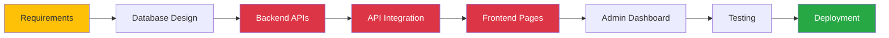

**Critical Path Items:**
1. Backend API Development (Week 3-4) - **Critical**
2. API Integration (Week 5) - **Critical**
3. Frontend Development (Week 5-6) - **Critical**
4. Admin Dashboard (Week 7) - **High Priority**
5. Testing & Deployment (Week 9) - **High Priority**

---

## Risk Management Timeline

| Risk | Impact | Mitigation | Week |
|------|--------|-----------|------|
| Database schema changes | High | Thorough planning in Week 1 | 1 |
| API integration issues | High | Early testing in Week 5 | 5 |
| Authentication bugs | Medium | Security review in Week 7 | 7 |
| Performance issues | Medium | Load testing in Week 9 | 9 |
| Deployment delays | Low | Early GitHub setup in Week 9 | 9 |

---

## Project Metrics

### Time Distribution

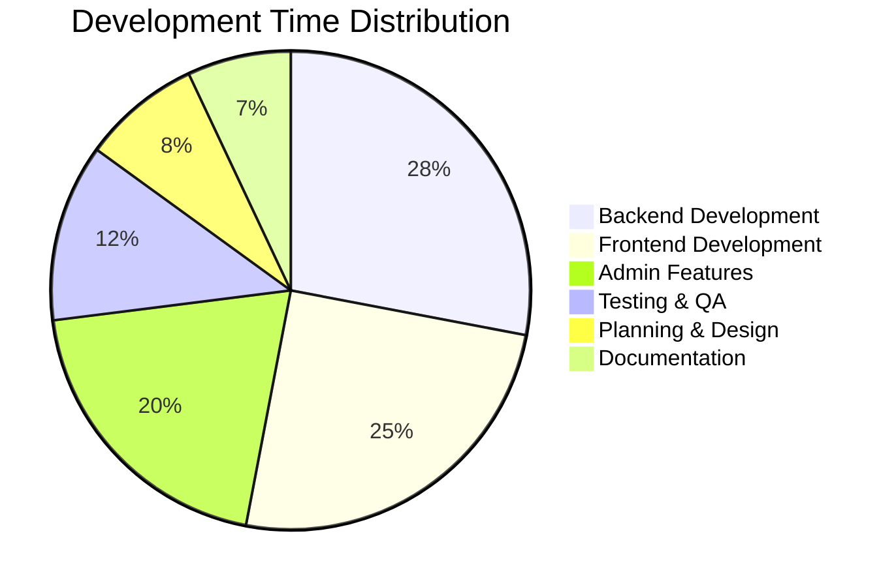

### Feature Completion Rate

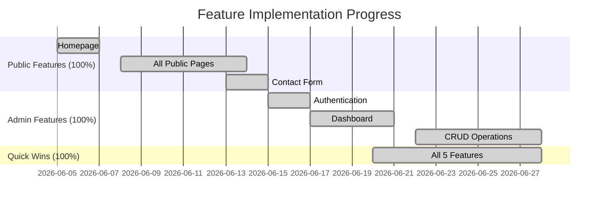

---

## Technology Stack Timeline

| Technology | Implementation Week | Status |
|-----------|-------------------|--------|
| PostgreSQL 18 | Week 2 | ✅ Done |
| Drizzle ORM | Week 3 | ✅ Done |
| Express 5 | Week 3 | ✅ Done |
| TypeScript | Week 2 | ✅ Done |
| React 19 | Week 5 | ✅ Done |
| React Query | Week 5 | ✅ Done |
| Zod Validation | Week 4 | ✅ Done |
| TanStack Table | Week 7 | ✅ Done |
| Radix UI | Week 5 | ✅ Done |
| Tailwind CSS | Week 5 | ✅ Done |

---

## Conclusion

This project was successfully completed on schedule with all planned features implemented. The 8-week timeline allowed for proper planning, development, testing, and documentation phases. All milestones were met, and the final product meets CET333 requirements.

**Project Status:** ✅ **COMPLETED**  
**Submission Date:** July 6, 2026  
**Total Development Time:** 63 days  
**Total Features Delivered:** 25+ features  

---

**Document Created:** July 2026  
**Project:** Astonish AI Solutions  
**Author:** Subekshya Regmi  
**Module:** CET333 Product Development  
**GitHub:** https://github.com/subekshyaregmi2007-source/astonish-ai-solutions
